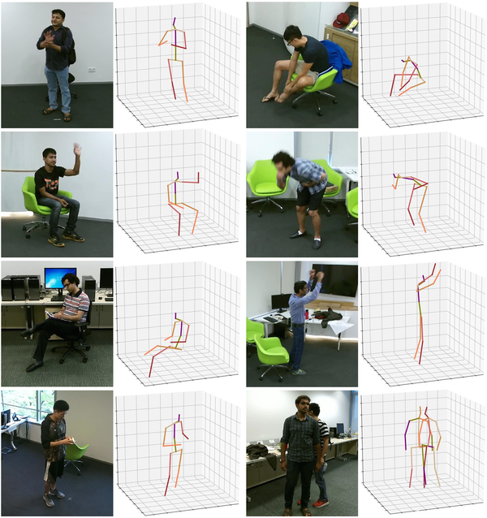

# Online skeleton-based action recognition with multi-feature early fusion

## Introduction
Existing skeleton-based action recognition methods input a whole segmented action sequence and adopt later fusion
to integrate the multi-stream results, which causes a large amount of computation and is not suitable for online application. This
paper proposed an online skeleton-based action recognition method with multi-feature early fusion. The approach integrated
different types of input feature through the early embedding layer and combined the max pooling and hierarchical pooling to
extract multi-semantic spatial information. Moreover, the selection strategy of skeleton sequences was carefully designed. A
new 3D skeleton dataset, NTU-GAST Skeleton, with 17 joint points was made to be compatible with existing 3D human pose
estimation methods for online action recognition. Experiments on two available benchmark datasets NTU60 and 120 RGB+D
indicate that the proposed method achieves competitive performance comparison to state-of-the-art results with more than
50×less computational complexity.

## Online Skeleton-based Action Recognition with A Single RGB Camera
- [Real-time online action recognition with a single RGB camera](https://www.bilibili.com/video/BV1e54y1i7iT/?spm_id_from=333.788.videocard.0)


## Prerequisites
The code is built with the following libraries:
- Python 3.6
- [PyTorch](https://pytorch.org/) 1.3

## Data Preparation

### NTU-GAST Skeleton dataset
<div align=center>

</div>

- Download [NTU-GAST Skeleton](https://pan.baidu.com/s/1l-xAiTJq-9mOQpwf59naEA) dataset from Baidu drive. Extraction code:3bid. Google drive: [NTU-GAST Skeleton](https://drive.google.com/file/d/1y846b2SA3RqJYovHGfAEyQzMuEnXKVhx/view?usp=sharing)
- Extract the dataset to ./data/NTU-GAST-Skeleton
- We use the dataset of GAST60 (NTU-GAST60 Skeleton) as an example for description.
```bash
    cd ./data/gast60/
    # Preprocess .h5 file of skeletons to .pkl file
    python preprocess_gast60.py
    # Get the training and evaluation data
    python protocol_gast60.py
```


### NTU RGB+D dataset

We use the dataset of NTU60 RGB+D as an example for description. We need to first dowload the [NTU-RGB+D](https://github.com/shahroudy/NTURGB-D) dataset.

- Extract the dataset to ./data/ntu/nturgb+d_skeletons/
- Process the data
```bash
    cd ./data/ntu
    # Get skeleton of each performer
    python get_raw_skes_data.py
    # Remove the bad skeleton 
    python get_raw_denoised_data.py
    # Transform the skeleton to the center of the first frame
    python seq_transformation.py
```


## Training

```bash
# For the CS setting
python  main.py --network ESN --train 1 --case 0
# For the CV setting
python  main.py --network ESN --train 1 --case 1
```

## Testing

- Test the pre-trained models (./results/NTU60/SGN/)
```bash
# For the CS setting
python  main.py --network ESN --train 0 --case 0
# For the CV setting
python  main.py --network ESN--train 0 --case 1
```

## Reference
- The NTU-GAST Skeleton dataset was generated by [GAST-Net](https://github.com/fabro66/GAST-Net-3DPoseEstimation) 

- Note that some codes references [SGN](https://github.com/microsoft/SGN) 